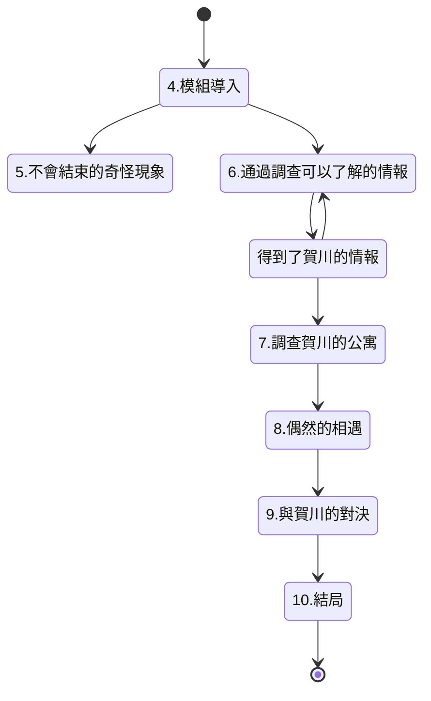

## おまえがちょうどいい
## “就是你了。”/“你剛好合適。”

以學校為舞台，高中生調查員專用模組。也適合技能值比較低的調查員。  
作者：內山靖二郎  

## 1：前言
本模組是“克蘇魯神話TRPG”規則下，適合2-4個角色為高中生調查員的模組。  
不包含車卡環節的話，跑團時間大約為2小時。  
背景為現代日本，以調查員所在的學校為中心展開故事情節。  
調查員通過調查在學校中接二連三發生的奇怪事件，而讓即將發生的悲劇防範於未然。  
這個模組為了讓因為EDU比較低而導致技能點也相對比較少的高中生調查員也能得到樂趣，  
而沒有設定太多必須骰點成功的場合。希望玩家是高中生的話也能享受本模組。  

2：給KP的情報
16年前，調查員的學校有一名叫與坂梨世的女學生。  
在校期間，與坂梨世懷孕了，她去尋求班主任的幫助，  
然而從班主任嘴裡聽到的卻是包含著斥責的無情話語。  

有流言稱正是因為受到老師的言語打擊，與坂梨世才再也沒來過學校，  
之後還離家出走，甚至還有傳聞說她最後自殺了。  

她的班主任賀川康史認為都是因為自己的過錯才導致與坂梨世自殺，於是引咎辭職。  
但即使如此罪惡感也無法消失，更漸漸成為他的心病。  
那之後過了16年，到了現在。  
賀川康史辭職之後一直蝸居在自己的公寓中，在持續的自責中孤獨而終。  
然而，有個東西回應了賀川“想要向與坂梨世贖罪“的執念，那就是賀川學生時代偶然從歐洲得到的石像。  
這個石像竟然是古代人仿造莎布·尼古拉斯所做的聖遺物。  

不詳的奇蹟使賀川作為亡靈復活了，  
他的目的是將那個未能降生於世的孩子帶給自殺了的與坂梨世，他深信那是最好的贖罪。  

賀川的亡靈想要找到一個“剛好合適”的調查員——那個孩子如果順利出生，  
經過16年的成長應該會成為這樣的人吧？  

調查員之一 “剛好合適“，就這樣被他盯上了。  
然而諷刺的是，賀川的執念都源自他的誤解。  
與坂梨世並沒有自殺，她的孩子更是已經好好地成長為一名高中生了。  
為了將賀川從虛妄的執念中解放，調查員必須讓他了解到事情的真相。  

### 高中生調查員
本模組希望可以讓高中生調查員在未成年的製約中拼命對抗恐怖。  
高中生調查員除EDU以外的屬性全部遵照“克蘇魯神話TRPG”的規則來車卡就可以了。  
只有EDU不需要擲骰，固定為“希望扮演的角色年齡-6”。  
比如，如果想車一張16歲的調查員的卡的話，EDU就是固定為10。  
（*此處為6版規則，7版可以是上述結果再x5，即EDU為(16-6)x5=50）  
職業自由選擇就可以。  
但是，因為是高中生，所以只是當做“以這個職業為目標的高中生”而已。  
即使選擇職業為“醫生”，這個調查員也並沒有醫生執照，  
而只是有著醫生相關的知識和素養，社會地位依然只是高中生。  

## 3：主要NPC
### 賀川康史
以前是調查員所在學校的老師，教世界史。  
因為性格太過較真、什麼事情都過於計較而導致無法順利地融入周圍人的社交之中。  
也正是因為他的內心不夠豁達才會對與坂梨世過於嚴苛。  
因為與坂梨世自殺的傳聞而產生了罪惡感，最後在心病之下從學校離職。  
那之後，他一直在學校附近的公寓中蝸居著，16年中一直為到底怎樣才能對與坂梨世贖罪而苦惱著，  
最後孤獨而終，享年48歲。  
這樣的他即將死亡的那個瞬間忽然想到，要向與坂梨世贖罪的話，  
只要從學生中找出適合做她孩子的人，然後獻祭給她就可以了。  
因為大學時代是考古學專業的學生，他有一個莎布·尼古拉斯的小雕像（有著5個乳房的女性雕像）。  
不幸的是，那正是可以與莎布·尼古拉斯聯繫的危險的聖遺物。  
賀川的房間在掌管多產的莎布·尼古拉斯的力量的影響下，觀葉植物風鈴草長得異常繁茂。  
也因此，在他的亡靈出現的時候，四周會伴隨著風鈴草的香氣。  
受到莎布·尼古拉斯加護的賀川的亡靈得到了可以操控人的記憶、引發各種奇怪現象的能力。  
但是這個力量他只會用來尋找可以當做與坂梨世的孩子來獻祭的“剛好合適”的學生。  

賀川泰史的亡靈，尋找“剛好合適”的男人  
STR 16(80)    CON16(80)    SIZ22(90)    INT17(85)
POW18(90)   DEX11(55)    HP19
DB加值：+1d6
武器：無
護甲：無法受到武器造成的物理傷害。有法術加持的或者帶有魔力的武器可以對他造成正常傷害。
法術：無
San值喪失：根據姿態而變化

### 與坂梨世
大概十六年前在調查員所在學校就讀的女學生。  
當時網上流傳著她自殺的傳言，但那隻是無憑無據的謠言。  
現在的她正在遠方作為與坂杏裡（16歲）的母親過著平凡的生活。  
模組的結局裡，她聽聞有調查員正在調查自己相關的事而回到了母校。  
雖然母校中有著她不堪回首的回憶，但或許正因如此，她才再次回到這裡，希望與過去做個了斷。  

## 模組流程圖
