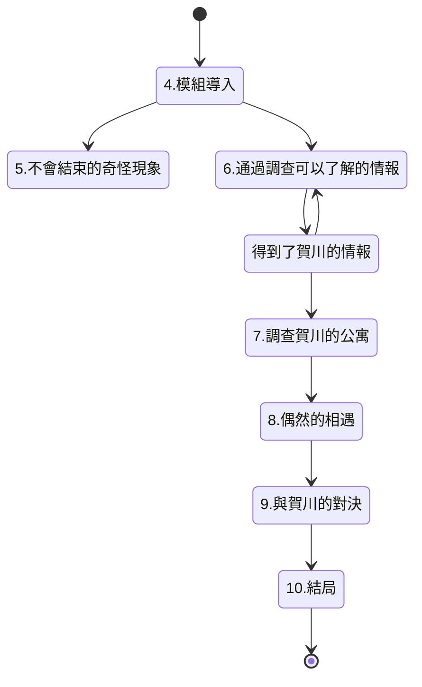

## おまえがちょうどいい
## “就是你了。”/“你剛好合適。”

以學校為舞台，高中生調查員專用模組。也適合技能值比較低的調查員。  
作者：內山靖二郎  

## 1：前言
本模組是“克蘇魯神話TRPG”規則下，適合2-4個角色為高中生調查員的模組。  
不包含車卡環節的話，跑團時間大約為2小時。  
背景為現代日本，以調查員所在的學校為中心展開故事情節。  
調查員通過調查在學校中接二連三發生的奇怪事件，而讓即將發生的悲劇防範於未然。  
這個模組為了讓因為EDU比較低而導致技能點也相對比較少的高中生調查員也能得到樂趣，  
而沒有設定太多必須骰點成功的場合。希望玩家是高中生的話也能享受本模組。  

2：給KP的情報
16年前，調查員的學校有一名叫與坂梨世的女學生。  
在校期間，與坂梨世懷孕了，她去尋求班主任的幫助，  
然而從班主任嘴裡聽到的卻是包含著斥責的無情話語。  

有流言稱正是因為受到老師的言語打擊，與坂梨世才再也沒來過學校，  
之後還離家出走，甚至還有傳聞說她最後自殺了。  

她的班主任賀川康史認為都是因為自己的過錯才導致與坂梨世自殺，於是引咎辭職。  
但即使如此罪惡感也無法消失，更漸漸成為他的心病。  
那之後過了16年，到了現在。  
賀川康史辭職之後一直蝸居在自己的公寓中，在持續的自責中孤獨而終。  
然而，有個東西回應了賀川“想要向與坂梨世贖罪“的執念，那就是賀川學生時代偶然從歐洲得到的石像。  
這個石像竟然是古代人仿造莎布·尼古拉斯所做的聖遺物。  

不詳的奇蹟使賀川作為亡靈復活了，  
他的目的是將那個未能降生於世的孩子帶給自殺了的與坂梨世，他深信那是最好的贖罪。  

賀川的亡靈想要找到一個“剛好合適”的調查員——那個孩子如果順利出生，  
經過16年的成長應該會成為這樣的人吧？  

調查員之一 “剛好合適“，就這樣被他盯上了。  
然而諷刺的是，賀川的執念都源自他的誤解。  
與坂梨世並沒有自殺，她的孩子更是已經好好地成長為一名高中生了。  
為了將賀川從虛妄的執念中解放，調查員必須讓他了解到事情的真相。  

### 高中生調查員
本模組希望可以讓高中生調查員在未成年的製約中拼命對抗恐怖。  
高中生調查員除EDU以外的屬性全部遵照“克蘇魯神話TRPG”的規則來車卡就可以了。  
只有EDU不需要擲骰，固定為“希望扮演的角色年齡-6”。  
比如，如果想車一張16歲的調查員的卡的話，EDU就是固定為10。  
（*此處為6版規則，7版可以是上述結果再x5，即EDU為(16-6)x5=50）  
職業自由選擇就可以。  
但是，因為是高中生，所以只是當做“以這個職業為目標的高中生”而已。  
即使選擇職業為“醫生”，這個調查員也並沒有醫生執照，  
而只是有著醫生相關的知識和素養，社會地位依然只是高中生。  

## 3：主要NPC
### 賀川康史
以前是調查員所在學校的老師，教世界史。  
因為性格太過較真、什麼事情都過於計較而導致無法順利地融入周圍人的社交之中。  
也正是因為他的內心不夠豁達才會對與坂梨世過於嚴苛。  
因為與坂梨世自殺的傳聞而產生了罪惡感，最後在心病之下從學校離職。  
那之後，他一直在學校附近的公寓中蝸居著，16年中一直為到底怎樣才能對與坂梨世贖罪而苦惱著，  
最後孤獨而終，享年48歲。  
這樣的他即將死亡的那個瞬間忽然想到，要向與坂梨世贖罪的話，  
只要從學生中找出適合做她孩子的人，然後獻祭給她就可以了。  
因為大學時代是考古學專業的學生，他有一個莎布·尼古拉斯的小雕像（有著5個乳房的女性雕像）。  
不幸的是，那正是可以與莎布·尼古拉斯聯繫的危險的聖遺物。  
賀川的房間在掌管多產的莎布·尼古拉斯的力量的影響下，觀葉植物風鈴草長得異常繁茂。  
也因此，在他的亡靈出現的時候，四周會伴隨著風鈴草的香氣。  
受到莎布·尼古拉斯加護的賀川的亡靈得到了可以操控人的記憶、引發各種奇怪現象的能力。  
但是這個力量他只會用來尋找可以當做與坂梨世的孩子來獻祭的“剛好合適”的學生。  

賀川泰史的亡靈，尋找“剛好合適”的男人  
STR 16(80)    CON16(80)    SIZ22(90)    INT17(85)
POW18(90)   DEX11(55)    HP19
DB加值：+1d6
武器：無
護甲：無法受到武器造成的物理傷害。有法術加持的或者帶有魔力的武器可以對他造成正常傷害。
法術：無
San值喪失：根據姿態而變化

### 與坂梨世
大概十六年前在調查員所在學校就讀的女學生。  
當時網上流傳著她自殺的傳言，但那隻是無憑無據的謠言。  
現在的她正在遠方作為與坂杏裡（16歲）的母親過著平凡的生活。  
模組的結局裡，她聽聞有調查員正在調查自己相關的事而回到了母校。  
雖然母校中有著她不堪回首的回憶，但或許正因如此，她才再次回到這裡，希望與過去做個了斷。  

## 模組流程圖

## 4：模組導入
KP需要先決定調查員上學的學校。  
學校本身並沒設置什麼特別之處，因此以KP或者PL的母校為原型設計就可以了。  
更容易讓PL腦海中浮現出形象的學校或許能讓玩家更加興味盎然吧。  

接下來，KP需要決定成為老師亡靈的目標的調查員是誰（以下用目標調查員代指）。  
這個模組以調查圍繞在目標調查員身邊連續發生的怪奇事件為主要內容，  
因此，定為與其他調查員均有背景關聯的角色或許更好吧。  

KP決定好目標調查員後，  
將“這個調查員就是怪事的目標”和今後模組的一部分情節走向向其他PL說明，  
讓他們自己討論也不錯。  

選擇一個“讓他作為目標人物，  
其他人也會有幫助他的動力吧”的調查員是使這個模組成功進行下去的小訣竅。  

決定好目標調查員之後，終於故事就要正式開始了。  
調查員的周圍接二連三發生怪事。  
KP將以下的“導入事件”分給各自適合的調查員，告訴他們學校內正在發生奇怪的事。  

### 導入事件1：“你不行啊。”
這是最早發生的事件。  
目標調查員以外的玩家遇到在學校裡尋找“剛好合適”的學生的賀川的亡靈。  
KP盡量選擇與目標調查員有著很容易區分的不同外貌和性格的其他調查員。  
傍晚時分，調查員因為某些事情而滯留在學校中，他一個人走在被晚霞染紅的走廊中。  
這個時候，他忽然感到自己似乎被某種東西注視著。這裡進行【偵查】判定。  
【偵查】成功的話，會注意到走廊盡頭處站著一個黑色的人影。  
但是，那個人影搖搖晃晃、扭曲著縱向伸長著，  
雖然覺得是不是因為日頭西斜而使得他的影子看起來好像延長了一般，  
但很快就會發現並不是那樣。  

人影像蛇一樣沿著走廊的天井伸展著，  
慢慢向調查員的頭頂迫近，  
同時，走廊裡隱約浮起一縷香甜的氣息。  

調查員並沒有逃跑，而是看著影子過來的情況下，  
不久影子就會到達他的頭頂，接著膨脹出一個圓形，  
在那個圓形的影子上有一雙眼睛。  
眼睛注視著調查員，明明沒有嘴，卻能聽到它喃喃低語道：“你不行啊。”  

調查員逃跑的情況下，會聽到從背後傳來它低喃“你不行啊”的聲音。  
不管是哪種情況，體驗了這樣恐怖的事情的調查員會失去1/1d4的San值。  

在走廊裡【偵查】失敗的情況下，明明身邊一個人也沒有，卻覺得被誰注視著而感覺到不安。  
不久鼻端就傳來一縷細微的甜香，然後耳邊忽然聽到誰低喃道：“不是你啊。”  
那不是從別處，就是從調查員耳邊傳來的，然而明明走廊裡一個人也沒有。  
體驗了這樣奇妙的情境的調查員會失去0/1d3點San值。  

不管怎麼樣，聽到了“你不行啊”的聲音的調查員可以進行一個【靈感】判定，  
成功的話，會發現那是一名成年男性的聲音。  
並且，如果【心理學】鑑定成功，會感覺到那個聲音聽起來有些灰心。  
然後，走廊裡還瀰漫著淡淡的香甜氣息。  
【生物學5倍】或者【靈感】鑑定成功的話，會知道那是花香。  

### 導入事件2：被學生看到了
目標調查員以外的角色遭遇的事件。  
調查員在樓梯間或者走廊下等昏暗的場所裡的時候，遇到了尋找“剛好合適”的學生的賀川的亡靈。  
那是有著圓形大頭的暗淡的黑色人影，但是卻可以清晰地看到它的眼睛。  
【心理學】鑑定成功的話，可以從它的目光中感受到悲傷。  

賀川的亡靈一直在暗處注視著校園、教室等有著大量學生的地方，  
看起來就像在從學生里尋找著什麼人的樣子。  

調查員想對亡靈進行什麼行動的話，它很快就會將目光轉向調查員所在的方向，  
一邊“軲轆軲轆”地轉動著眼珠一邊喃喃著：“不找的話……不找到TA的話……”然後就這樣慢慢消失。  
目擊到亡靈的調查員會失去0/1d4點San值。  

在亡靈待過的地方可以聞到一絲細微的香甜氣息。  
【生物學5倍】或者【靈感】鑑定成功可以得知那是花的香氣。  

即使什麼也不做，最後亡靈也會慢慢消失。這樣的情況下調查員只需要失去0/1點San值。  
這個事件會讓調查員明白自己被不知道正體的未知生物盯上了。  

### 導入事件3：被盯上了
賀川的亡靈盯上目標調查員的事件。這個事件在其他導入事件完畢之後才會發生。  
當目標調查員遭遇此事件時，其他調查員一起在場也不錯。  
目標調查員正在教室裡上課，講台上是一名中年老師，  
因為這位老師講課實在過於無趣，目標調查員產生了睡意。  

正在目標調查員昏昏欲睡的時候，忽然感覺某個人的手放在了自己的肩頭，  
耳邊傳來“就是你了”的說話聲。  

一開始你還以為這是正在講課的老師的聲音，  
然而抬起頭，卻發現老師依然在前方的講台上進行著枯燥的授課，  
而你四處張望，也無法找到聲音的主人。  

從你的肩頭傳來細微的甜香。  
【5倍生物學】或者【靈感】判定成功可以得知，那是花的香氣。  
經歷了這樣怪異事件的調查員失去0/1d3點San值。  

回想那個聲音進行【心理學】判定，成功的話，能發現那是十分滿足的聲音。  

## 5：不會結束的怪奇現象
導入結束之後下面的各種怪奇現象依然會持續發生。  
KP根據調查員的行動挑選合適的時間讓事件發生。  
比如學校的日常生活啊，或者在圖書館進行調查時加入怪氣現像等。  
另外，這些事件也可以作為當調查員在追查真相的過程裡畏首畏尾時督促他們盡快前進、亦或在調查陷入僵局時給與提點的手段。  
當覺得調查員的行動變得遲鈍的時候讓這些事件發生就可以了。  
但是，所有的事件並不是全部必出的。  
KP覺得適合當下的狀況或者根據遊戲時間來選擇喜歡的事件開啟就可以了。  

### 抱歉，搞錯了
這個事件儘早發生比較好。當目標調查員在場時開啟。  
賀川的亡靈為了把目標調查員當做與坂梨世的孩子來獻祭而開始操縱老師的記憶。  
上課中，或者在學校的走廊中，目標調查員被老師用“與坂”這樣沒聽說過的名字呼喚。  
雖然最開始並不覺得是在叫自己，但在等待目標調查員回應時，  
老師會喊自己好幾次，並說：“餵，與坂，沒聽到我在喊你嗎？”  
然後調查員就會發現老師是在用錯誤的名字喊自己吧？  

當調查員指出這一點時，老師會立刻承認自己的錯誤。  
但是，為什麼自己會把目標調查員的名字搞錯成“與坂”這樣有點奇怪的名字呢？  
老師本人看起來似乎是最奇怪的。  

當然，現在的學校裡並沒有叫做“與坂”的學生。  
這個名為“與坂”的名字的信息非常重要。  
必要的話，KP可以讓這個事件多次發生以求讓玩家對“與坂”這個名字留下深刻的印象。  

### 你媽媽來了哦
在學校的調查員全員開啟的事件。  
賀川開始策劃將目標調查員獻祭給與坂梨世。  
KP選擇一個喜歡的時間在學校裡播放校內廣播。  
播放內容是“與坂XX（此處填入目標調查員的名字部分）同學， 
與坂XX同學，你媽媽正在等著你，請現在立刻去見她”，這樣有點奇怪的內容。  
目標調查員沒有動作的情況、或者去廣播室的途中，這個廣播會持續重複播放，  
但是，廣播裡的語氣會變得越來越強烈。  
“請快點去見她。”“快去！快去啊！”“你就是剛好合適的人選！”  
但是，廣播內容卻並不告知“到底該去哪裡”。  
調查員能聽出，那個聲音與目前為止聽到過的賀川亡靈的聲音是一樣的。  
到此為止調查員也不行動的情況下，  
不久廣播裡就會傳出某個困惑的老師的聲音：“是誰播的這個惡作劇廣播？”  
即使調查員很快跑到廣播室，也會發現門上上著鎖。  
去辦公室或者找負責播放的人員借來鑰匙打開門，也會發現裡面並沒有人，  
而只是飄著淡淡的甜香氣息（是導入部分時聞到過的相同的花香）。  
如果在廣播室裡磨蹭太久的話，等到老師聞訊趕來時，說不定會把調查員當做惡作劇的犯人也不一定。  

### 讓我確認一下
目標調查員和其他調查員一起的時候開啟的事件。  
休息時間，目標調查員被班主任叫住了。  
班主任的設定由KP決定就可以了，並沒有什麼需要特別強調的地方。  
如果設定為一個平時很溫柔、學生非常信賴的老師，  
在之後的劇情展開里或許更能體現出反差感來吧？  

班主任的表情看起來很嚴肅。【心理學】鑑定成功的話，會感覺老師看起來有點害怕。  

他鐵青著臉問：“讓我確認一下，你……以前叫與坂吧？”  

當然，班主任肯定是很清楚目標調查員的名字的，平時他也根本不可能犯這種錯誤。  

班主任會把所有目標調查員相關的資料上的名字都替換成“與坂”是有原因的，  
因為賀川的亡靈操控了他的記憶，進而導致他的記憶出現了混亂，  
誤認為目標調查員說不定真的是與坂。  

如果目標調查員給與“我就是與坂”這樣肯定的回答的話，  
班主任才會鬆了一口氣地說：“是嘛，你就是與坂啊，太好了，太好了！”這之後，  
即使再有人糾正他這個錯誤，他也會繼續把目標調查員稱呼為“與坂”。  

如果目標調查員否定的話，班主任的臉就會很快沉下來，  
然後大聲說：“不可能，你就是與坂，不是的話不行！”  
試圖安撫下來已經完全錯亂的班主任的話，  
目標調查員要么需要承認自己就是與坂，要么進行一個成功的【精神分析】鑑定。  

雖然陷入混亂的班主任並不會做出什麼暴力舉動，  
但直到調查員或者其他老師前來製服他為止，  
他都會唾沫橫飛地持續叫喊著：“你不是與坂的話就不行！”怎麼看他都不正常。  
目睹了班主任這樣劇烈變化的調查員會失去0/1點San值。  

另外，在場的調查員或許會被別的老師詢問發生了什麼吧？  
如果想要幫這位可憐的班主任保守名譽的話，  
需要進行適當的說明，並進行一個成功的【說服】鑑定。  

通過對班主任異常變化的強烈描述而讓調查員明白，  
如果不阻止這些怪事的繼續發生，影響會擴散得越來越大，總有一天會引發不好的事情。  

### 你的朋友是與坂吧
目標調查員以外的調查員身上開啟此事件。  
調查員的手機上接到不明發信人的電話。  
接起來後對面是一個男人的聲音，他詢問道：“你是與坂的朋友吧？”  
這時如果回答“是”的話，對面會用溫柔的聲音回復道：“今後也請繼續和與坂友好相處下去哦。”然後便掛斷了電話。  
如果否定的話，對面會尖叫道：“不可能！那是與坂！快和她做朋友！”然後電話便被切斷了。  
那之後，調查員會發現，自己手機通訊錄裡登錄的目標調查員的名字，  
不知道什麼時候變成了“與坂”。  
這是因為賀川開始向周圍的人們的意識裡灌輸目標調查員就是與坂的認知了。  
雖然調查員的記憶還沒有被操控，  
但看著身邊的人都開始慢慢被灌輸進目標調查員就是與坂的記憶的這份恐懼感使其失去0/1d3的San值。  

### 排除壞朋友
發生在為了目標調查員而開始積極行動起來的調查員身上。  
賀川會敵視那些妨礙他把目標調查員改造成與坂的人。  
方法很簡單——  
在調查員走在台階上時推他一把使他跌落。如果【跳躍】鑑定失敗的話，會受到1D4點傷害。  
從學校高處掉落花盆啊、混凝土塊什麼的。 【閃避】失敗的話會受到1D4點傷害。  
等類似的手段。  
在本模組裡，這些事件並非是要殺掉調查員。 KP只要讓調查員受點輕傷達到威脅的目的就可以了。  
被盯上的調查員為了得知到底發生了什麼而立刻尋找犯人的話，  
【偵查】成功可以感受到賀川的亡靈的氣息，或者能聞到淡淡的香甜氣息。  
但無法追踪氣息的去向，因為氣息會很快煙消雲散。  
遭遇到這些事情的調查員還會為了同伴而繼續行動下去嗎……測試一下調查員的勇氣吧。  

## 6：通過調查可以了解的情報
經歷過上述事件的調查員應該能注意到“與坂”這個名字就是解決事件的關鍵吧。  
但是，他們即使向老師詢問16年前的事也沒用。  
一般的老師5年就會調動一次，現在已經沒有當時在這個學校任教的老師了。  
調查員必須通過別的途徑才能知道16年前發生了什麼。  

### 畢業紀念冊
調查員調查學校圖書館裡收藏著的畢業紀念冊上是否有名叫“與坂”的學生的時候，  
會在16年前的大合照上找到與坂梨世。  

如果之前調查有進展，知道16年前的紀念冊上肯定會有的話就不需要再技能鑑定。  

如果沒有的話，需要一個不漏地把所有紀念冊都調查一遍，  
如果【圖書館】的2倍鑑定失敗的話，就會遺漏掉與坂梨世那一頁，  
徒然地浪費時間（直到學校圖書館閉館的時間）。  
但是，第二天可以再次骰點挑戰。  

照片上的是一個看起來挺精神的女孩子。  

但是，這張照片卻給人一種違和感。 【攝影的5倍】鑑定成功的話，  
與其他學生不同，會感覺與坂梨世的圖像是合成上去的。  
這是因為拍畢業照的時候，與坂梨世已經離家出走，  
最後是把她家人提供的照片和校服以及背景合成到一起製作而成的。  

看過照片，【靈感】判定成功的話，會沒來由地感覺她和目標調查員有點像。  
當然，這只是巧合而已。  

另外，上面還拍攝有負責他們班的老師們，包括賀川和別的老師。  

與坂梨世的事情發生後就更換了班主任。  
新的班主任是一位50歲左右名叫鈴木健次的平凡男老師，當然，這個情報並不那麼重要。  

### 了解當時情況的人們
16年前的畢業生，當時將孩子們送到這裡來上學的家長們，  
學生們聚集的店鋪，附近喜歡聊八卦的居民等，從他們這裡都可以得到情報。  

可以碰巧有個跟調查員相識的這樣的人，也可以讓調查員自己去親自調查。  

詢問是否了解關於與坂這個人或者16年前學校發生了什麼之類的問題時，  
雖然人們的記憶已經有些模糊了，卻還是會記起以下情報。  
KP把<與坂這個學生>的玩家資料1給出即可。  

但很可惜的是，提供情報的人也記不得問題老師的名字，只記得他大概30歲上下。  

### 網絡上的流言
充分利用網絡可以查到16年前這個學校發生的事是否還有殘留的信息。  
雖然沒找到與坂這個名字，但因為16年前有關於調查員的學校的網絡流言，  
所以即便到了現在網上仍然能查到只言片語。  
但是，想從浩瀚的網絡海洋裡查到有用的信息需要花費2小時，  
同時還需要【5倍計算機】或者【圖書館】技能鑑定成功。  

成功的話，可以給出玩家資料2< Y相關的網絡流言>。  
失敗的話會被錯誤的情報迷惑，只能得到“16年前好像有個女學生自殺”的情報。  
雖然這個技能不能重複檢定，但可以請別的調查員幫忙挑戰。  

### 問題老師
如果想查找有沒有從16年前開始一直在學校任職的老師之類的人的話，  
會被告知教導主任已經在本校連續工作16年了。  

教導主任的名字是宮城和喜子。  

她是一位和這個學校淵源頗長的40多歲的女性，  
因為工作的關係，對16年前發生在與坂和賀川之間的事還記得很清楚。  

想要從她這裡得到賀川的消息，  
需要同時給出“16年前”“與坂”“辭職的老師”三個關鍵詞，  
之後說明為什麼想知道這些事，再過一個成功的【說服】技能鑑定才行。  

對於像教導主任這樣和學生談話的專家而言，【話術】一類花言巧語是行不通的。  
這種場合，比起敷衍的謊言，還是嚴肅、真摯的態度更能打動她。  

因為教導主任是一個很好溝通的人  
，所以如果將班主任的忽然改變、因為賀川的亡靈而導致調查員遭遇危險等事情告訴她的話，  
她就會明白調查員並不是為了滿足單純的好奇心才來打聽這些事的。  

另外，表現出自己是一名正直的學生，  
然後過一個【信譽】來獲得教導主任的信任也可以。  

KP可以根據調查員的RP來給與10%~40%的【說服】加值。  

如果成功說服了教導主任的話，KP就可以給出玩家資料3<關於與坂和辭職的教師>的信息了。  

如果調查員還沒有見過與坂梨世的畢業照的話，  
這裡可以請教導主任給他們看當時的照片。  
（因為與坂梨世的照片是非常重要的線索，所以請不要忘記及時將情報提供給調查員。）  

即使這裡【說服】失敗，也可以在得到新情報之後、改變說服方向或者換個時間等手段再次挑戰。  

雖然這個情報是本模組最難得到的情報，  
但如果連這個情報都能得到的話，之後的劇情就可以一口氣展開了。  

遊戲時間比較緊張的情況下，KP可以安排調查員從前面“了解當時情況的人們”那裡得到這個情報。  

### 細微甜香的真面目
調查員或許會去調查伴隨著賀川的亡靈出現的淡淡甜香到底是什麼。  
那是非常清爽的花香，【生物學】檢定成功的話，可以知道那是名為風鈴草的觀葉植物的香氣。  
去花店調查香氣的真面目的話，【幸運】檢定成功之後【靈感】再檢定成功的話，  
可以讓調查員找到同樣的花香。  

風鈴草有各種各樣的種類，一般是莖上大量開著像吊鐘一樣垂下的淡紫色花朵的那種。  
花季是初夏到盛夏。
調查員在網上或者圖書館調查風鈴草相關的資料的話，  
不需要過技能就可以知道，風鈴草的花語之一是“誠實”。  

賀川對於自己沒能用誠實的態度應對與坂梨世這件事非常後悔，所以在房間裡養了風鈴草。  

> ### 與坂這個學生
> (“就是你了”玩家資料1 <與坂這個學生>)  
> 大概16年前，有個名叫與坂梨世的女學生失踪了。  
> 聽說這個與坂似乎懷孕了。  
> 有學生傳言說與坂在消失之前被她想要諮詢的老師說了非常過分的話。  
> 校方卻主張這名老師沒有責任。  
> 沒過多久，那名老師就從學校離職了。  

> ### Y相關的網絡流言
> (“就是你了”玩家資料2 < Y相關的網絡流言>)＊與坂梨世-Yosaka Riyou
> 以下是將16年前登錄在網絡上的、似乎和事件有點關係的流言按時間順序排列整理的合集。  
> 
> ■女學生Y貌似不在家裡。  
> ■女學生Y好像失踪了。  
> ■有人說是她的老師的錯。  
> ■女學生Y和一個男的在交往。  
> ■但那個男的跑了。渣男！  
> ■學校好像知道這件事。  
> ■女學生Y好像自殺了誒。  
> ■那個老師辭職了。活該。  
> ■之前在學校附近看到那個老師了，真噁心。  
> ■垃圾老師，詛咒你！  

> ### 關於與坂和辭職的老師
> (“就是你了”玩家資料3 <關於與坂和辭職的老師>)
> 16年前，名叫與坂梨世的女學生懷孕了。  
> 她找班主任賀川康史商量這件事，卻被無情的話語斥責了。  
> 因此深受打擊的她拒絕來學校上課，之後甚至離家出走了。  
> 那之後，與坂的家人也搬家了，校方也無法得到現在的他們的情報。  
> 學生之間流傳著與坂梨世已經自殺了的謠言，但並沒有人去確認真相。  
> 因為對與坂梨世的失踪感覺到強烈的自責，沒多久賀川就辭職了。  
> 之前偶然聽說他現在似乎在學校附近的公寓裡獨居著。  

## 7：去賀川的公寓調查吧
想去賀川的公寓調查的話有幾種方法可以考慮。  
學校的教職員檔案裡有留下賀川住處的記錄（他從16年前開始就沒有搬過家）。  
但是，學生想直接調查教職員檔案是不可能的。  

使用適當的器材經過一個成功的【電腦使用】檢定的話可以入侵學校的電腦系統查閱資料。  

另外也可以在深夜潛入職員室偷偷閱覽檔案，  
這種情況需要過一個成功的【圖書館】或者【會計】技能檢定。  

用“朋友曾經受過賀川老師的幫助，  
所以想知道他的聯繫方式”之類合適的藉口向老師詢問賀川的住址也可以。  
但這樣的情況下需要過一個成功的【話術】或者【信譽】。  

即使不用上述方法，因為學校周邊的公寓區也沒那麼多，  
所以調查員自己親自去尋找賀川的住處也不失為一個辦法。  

【導航】檢定成功的話，可以提高效率，只用半天就能找到賀川的住處。  
如果活用手機上的地圖服務的話可以得到20%的技能加值；  
另外，有使用自行車之類的移動手段的話可以額外得到20%的技能加值；  
尋找 “有風鈴草，飄著香氣”的公寓可以再得20%的加值。  

當然，調查員在尋找賀川公寓時如果有別的方法KP一樣可以積極採用。  

終於找到賀川的住處了，那是一棟面向單身者的古老的2層木造公寓。  
離調查員的學校近到直接能看到。  

有6個房間。房主不住在這裡。住戶似乎也都去上班了，公寓裡沒什麼人。  

從外面看，2層某個房間窗邊能清晰地看到盛開著的淡紫色花朵。那就是風鈴草的花。  

從郵箱那裡標著的名字上可以看到賀川的房間在2層盡頭（203號）。  
賀川似乎沒有將報紙取走，郵箱裡堆滿了郵寄廣告和傳單。  
查看從何時開始這些郵件沒有被收走的話，能發現是從調查員身邊開始出現超常現象的時候。  

來到203號房間，從門的另一側傳來陣陣在學校裡已經聞到過好幾次的甜香。  
因為門並沒有鎖上，所以可以簡單地進入房間裡面。  

一打開賀川的房門，就會發現裡面充斥著風鈴草的香氣。  
因為房間很狹小，所以打開門後，即使站在走廊裡也可以將房間裡的樣子一覽無餘。  
玄關一側是一個小小的廚房，起居室大概8疊榻榻米大，  
是個帶浴室的一居戶型。房間裡的擺設非常簡單，  
只有一個放滿了歷史和考古學類書籍的書架以及一個折疊桌。  

窗戶被密密麻麻生長的風鈴草所遮蓋，使房中光線暗淡。  
起居室的中央長著一片異常繁茂的風鈴草，風鈴草所組成的形狀仿似人形。  
這些是受莎布·尼古拉斯的力量影響而變異的。  
並且，成為這片風鈴草苗床的，正是賀川的屍體。  
被風鈴草的根所覆蓋，只能隱約看到他的輪廓，也沒有腐臭氣味。  
目擊了這個場景的調查員會失去1/1d4的San值。  

以賀川為中心，一直長到窗邊的大片風鈴草，  
仔細看去，會發現其他方向也延伸出了大量的根鬚。  
【靈感】檢定成功的話會發現那根鬚的走勢簡直像是伸出去的手一般。  

而在“手”的前端是書架，書架上擺著一個黑色的小小的石像。  
雖然房間裡還放著別的賀川的遺物，但對調查員而言，只有以下兩個東西是有用的。  

如果調查員在已經得到這兩個物品的情況下還繼續在房間裡浪費過多時間，  
KP可以提示他們“房間很小，似乎找不到其他有用的東西了”。  

### 賀川的筆記
調查書架的話，可以得到賀川的筆記。  
這是代替日記、為了從日漸加深的不安中逃離，  
而以自問自答模式記錄下來的雜亂的文字，其中羅列著大量意義不明的詞句。  

【精神分析】成功的話可以分析出這是賀川在用這樣的方式和筆記上的文字對話。  

筆記上的文字因為賀川的瘋狂與困苦而支離破碎、難以理解，  
所以想要解讀它的話需要過一個成功的【母語】或者【心理學】或者【精神分析】。  
檢定成功的話能得知，筆記上所記錄的人，  
因為與坂梨世的自殺傳聞而感到痛心疾首，並抱持著罪惡感。  

筆記中持續記錄著關於贖罪的詞語。上面文字的書寫力度隨著日期的經過漸漸變得虛弱，  
而很難看出寫的是什麼，  
但所記錄的幾乎都是對與坂梨世的提問：“到底怎麼樣才能向你贖罪呢？”  
最後他以羸弱的力量反複寫下了他最後的願望。 （玩家資料4<賀川的苦惱與贖罪>）  
技能檢定成功而讀了這本筆記的人的精神也會被賀川的瘋狂語言所侵蝕，自動失去1D3點San值。  

### 小小的石像
11cm高、似乎是女性姿態的石像。用黑色石頭雕刻而成，看起來是非常古老的東西。  
現在的時間點，石像是無害的。即使觸摸它、將它帶走也什麼都不會發生。  
這裡【幸運】檢定成功的調查員能從這個小小的石像上感受到言語難以描述的神秘力量。  
這樣KP就可以委婉地提示出這個雕像是關鍵物品了。  

但是，如果有暴力調查員將石像毀壞的話（將它砸向地板直接就能碎），就會發生劇烈的變化。  
莎布·尼古拉斯的力量會暴走。  

一直覆蓋在賀川屍體上的風鈴草轉眼間就變成了黑色，  
同時充斥在房間中的甜香也會變成令人作嘔的腐臭。  

之後房間裡所有的東西都會開始腐敗，釋放出有毒氣體。  
直接身處有毒氣體中會無法呼吸，此處繼續留在房中需要參照規則書裡的<窒息和溺水>規則（《克蘇魯神話TRPG》第62頁）。  
另外，目擊了這個異常現象的調查員失去0/1D4的San值。  

如果調查員想要知道這個石像的真面目而繼續調查房間中的相關線索的話，  
花費1小時並進行一個成功的【圖書館】技能檢定，會發現賀川還很正常的大學時的日記。  
即玩家資料5<小小的石像>所記錄的內容。  

即使不調查這本日記，調查員通過一個成功的【5倍考古學】和【歷史】檢定的話，  
也可以推測出這個小的石像“是不是古代人製作的信仰多產和豐收的象徵呢”。  

> ### 賀川的苦惱與贖罪
> (“就是你了”玩家資料4 <賀川的苦惱於贖罪>)
> “作為老師唯一能做的事就是，將順利長大的孩子帶到她的身邊。  
> 庇佑生產的女神啊，無論如何請實現我的願望吧……”

> ### 小小的石像
> (“就是你了”玩家資料5 <小小的石像>)
> “……在歐洲旅行的途中，偶然路過的古董店裡買到的小雕像……完全不知道其來歷，  
> 大概沒什麼學術價值吧……這個石像的外形和奧地利舊石器時代遺址上發現的<沃爾道夫的維納斯>很像。  
> 記得那是像徵著多產和豐收的信仰標誌。  
> 如果這個石像是同時代製作而成的話，就是2萬年前的造物了……不可能吧。”  

## 8：偶然的相遇
通過目前為止調查員調查過程裡接觸到的人物，  
自己正在被調查這件事傳到了住在遠方的與坂梨世耳朵裡。  

比如教導主任或者老師之類的因為對調查員的話語感到在意而找到了她家人的聯繫方式，  
或者通過朋友的朋友把調查員的話傳過去了等等。  

與坂是以什麼方式得知的調查員的事不重要，  
重要的是聽到了這個傳聞的與坂梨世親自來到了調查員的學校。  

調查員與與坂梨世相遇的事件發生在調查員搜索完賀川的公寓之後。  
可能的話選擇黃昏時還有學生在學校的時間點比較好。  
調查完賀川的公寓之後如果還沒到晚上的話，調查員剛剛從公寓裡出來的時候最好。  

調查員在學校附近的空地處發現一名眺望著校舍的中年女性，  
不知道為什麼覺得她和畢業照上面的與坂梨世很像。  

調查員向這位女性搭話之後，女性雖然會露出困惑的神情，  
但聽了調查員的話後會毫無戒備地說出自己的名字。  

讓人驚訝的是，她就是事件的中心人物——與坂梨世。  

要將事件對她說到什麼程度取決於調查員，但如果告訴她自己是她的校友的話，  
不管後輩說出什麼樣的話，她都會認真傾聽。  

聽說有孩子在調查自己的事之後，為了將心裡殘留的關於過去的不快回憶消去，  
與坂梨世回到了母校。
也就是說，她並不是積極地為了和調查員見面才來的這裡，  
僅僅是為了做好心理上的準備，才從遠處眺望學校。在這裡遇到調查員完全是偶然。  

從與坂梨世的話裡可以了解到，有段時間因為賀川的無情話語而受傷不去上學，  
之後還離家出走的事都是事實。但是，自殺一說則是毫無根據的謠言。  
雖然確實離家出走過，但沒多久就又回了家裡。  

那之後和家人好好商量過後就搬家去了遠方，為了將過去遺忘，轉變心態開始了新生活。  
懷孕的孩子也順利生了下來，作為單身媽媽而努力將她順利撫養成人。  
（孩子的爸爸完全是個渣男，已經和他沒有任何联係了，心裡也沒有任何留戀。）  

今天她的女兒杏裡也一起來了。似乎是為了參觀母親的母校而來的，  
現在正一個人在附近閒逛。女兒剛好和調查員們同樣大，並且和與坂梨世年輕時長得非常像。  

如果是第六感很強的調查員，或許會有預感，如果賀川的亡靈見到杏裡的話，可能會發生不好的事。  
不立刻去尋找杏裡的話，她會被賀川的亡靈帶去那個世界。  
KP可以向調查員描述因為遲遲等不到女兒回來而感覺到不安的與坂梨世的樣子，  
從而讓他們明白杏裡現在身處危險之中。  

## 9：與賀川的對決
與坂梨世的女兒杏裡現在在學校的校舍裡。  
打聽“你有看到這樣一個女孩子嗎”，在學校里四處找人詢問、搜查，很快就能發現杏裡。  
如果想讓調查員著急的話，也可以讓他們過【幸運】或者【敏捷】、【偵查】等技能檢定。  

但是，分開尋找的場合，為了避免有人錯過劇情高潮，  
而應該盡量讓已經發現了與之相似的少女的情報共享，好讓大家合流。  

不久調查員們就會在學校的走廊發現身著私服的少女。  
她背對調查員們站立著，而她朝向的走廊盡頭有著一片彷彿通向其他世界的不自然的黑暗，  
這黑暗令調查員心中湧動起不安。  
這時候走廊忽然傳來一陣巨大的轟鳴。  
“你更合適啊！”  
賀川的亡靈將和與坂梨世長得一模一樣的杏裡定為了新的目標。  
然後從走廊盡頭的黑暗裡伸出無數異常長的一團漆黑的觸手，將與坂杏裡抓住了。  
同時走廊的黑暗中有兩個巨大的悲傷的雙目浮在空中。那片黑暗即是賀川亡靈的真正姿態。  
與坂杏裡因為恐懼而雙腿發軟，完全動彈不得。  
雖然能幫助她的只有調查員，但目睹了賀川亡靈的真正姿態會先失去1/1D8的San值。  

以下是模組預想的調查員可能會有的行動。  
當然，如果調查員想出了除此之外的解救與坂杏裡的方法，也請積極採用。  

### 將與坂杏裡拽住
想從黑色觸手那裡將杏里拉回來的話，需要先跑向她，然後和STR 16(80)的黑色觸手過一個力量對抗。  
對抗成功的話，就可以將她從黑色觸手那里拉回來。  
這個對抗可以復數人協力完成（將共同對抗的調查員的STR加起來，只能對抗一次），  
在這期間不能進行【說服】等其他行動。另外，如果參加遊戲的只有2個調查員的話，  
則此處黑色觸手的STR設定為10。  

力量對抗成功的話，杏裡雖然可以被拉回己方，但黑色觸手為了不放開她會不斷扭曲伸長，  
很難讓她從危險中完全脫離。但是這個舉動可以爭取到與賀川的亡靈溝通的時間。  

力量對抗失敗的情況下，觸手會同時纏上調查員的脖子，用力攪緊，使調查員受到1D6的傷害。  
即使如此調查員也沒有放開杏裡的手的話，同樣能爭取到和它溝通的時間。  

### 向賀川說明
向賀川的亡靈說明“與坂梨世並沒有自殺，這個女孩子是她的女兒”是解決這次事件的最有效手段。  
至於如何向賀川說明就交給調查員RP了。  
想讓賀川明白他的執念都是誤會，需要調查員過一個【話術】。   
（這時候雖然不太適合需要花費時間的【說服】，  
但KP可以根據自己的判斷決定是否讓調查員用【說服】代替。）  

說明清楚與坂杏裡是與坂梨世的女兒的話，【話術】可以得到10%的加值。  
這時與坂梨世在場可以證明與坂杏裡就是她女兒的情況下（杏裡的手機裡有她和母親的合照），  
可以額外再得到10%的加值。  

另外，如果調查員的話裡有能夠觸動賀川的心靈的語句，  
或者在之前的調查過程中有調查員曾試圖幫賀川解開過人們對他的誤解的話，  
KP可以視情況給與10%~20%的【話術】加值。  

到這裡就是故事的高潮了。讓調查員花時間考慮一下用什麼樣的方法來解決作戰吧。  

如果技能判定失敗的話，賀川會無視調查員，直接將杏裡拖去那個世界。  

這時候如果調查員沒有拉著杏裡的話，她會就這樣被拖進黑暗中，從這個世界上消失。  
然後不會再次回到這個世界，目標調查員就這樣被放過了。  

如果調查員一直拉著杏裡來爭取時間的話，可以再次進行【話術】挑戰。  
但是，為了說服賀川，必須從別的話題方向切入，並且再次挑戰的機會只有一次。  

### 將莎布·尼古拉斯的雕像破壞
將雕像破壞或者扔進賀川帶來的那片黑暗中，可以削弱賀川的亡靈的力量。  
有4名調查員的情況下，為了增加緊張感，可以增加一些難度，  
比如破壞雕像的話需要通過【鬥毆】之類的攻擊每次造成3點損傷，  
將它在地板上連續砸的話需要【力量】判定成功。  
如果將它投擲進黑暗中，過一個【2倍的投擲】比較合適吧。  

將雕像破壞或者扔進黑暗中之後，走廊裡的黑暗會變淺，變成對調查員有利的情況。  

例如【話術】或者與觸手的力量對抗可以得到20%的加值。  
或者破壞雕像和投擲失敗的話可以得到珍貴的再次挑戰的機會，  
減少黑色觸手纏繞調查員脖子時受到的傷害也不錯。  

不管調查員打算用何種手段處理雕像來對付賀川的亡靈，這個雕像都會成為解決困難的關鍵。  

KP可以在杏里馬上就要被拖走的時候讓調查員們意識到，  
莎布·尼古拉斯的雕像還可以作為最後的王牌使用。  

但是，KP不用事先告訴調查員破壞莎布的雕像會造成什麼樣的後果，  
讓他們為了是否要真的破壞雕像而煩惱吧。  

### 莎布·尼古拉斯的雕像
大概2萬年前由莎布·尼古拉斯的信徒所製作的雕像。高11cm，用黑色的石頭雕刻而成。  
使用了極端的表現方式來刻畫女性豐滿的肉體，  
有五個乳房的獨特設計對原始人來說是多產的象徵，更包含了對大地母神的想像。  

雖然造型很奇特，但通過它卻有可能和莎布·尼古拉斯通信。  
但是，崇拜者必須有足夠瘋狂的強烈願望。  
如果這個願望傳達到了那位神那裡，那麼神的力量會讓奇蹟產生。  
但是，那其實是帶來悲劇的奇蹟吧？  

## 10：結局
聽完調查員的話，意識到自己的誤會後，走廊的黑暗消散了，  
賀川的亡靈現身，那是一個十分普通的中年男性的身姿。  

賀川向杏裡深深低下頭，對她說了以下的話：  
“我對你媽媽說過一些非常過分的話。  
我沒有一天不為此後悔……但是，她並沒有在意我的過錯，  
將你好好地撫養成人了。真的太感謝了，謝謝你能站在這裡。”  

對於調查員能給予他這樣贖罪的機會他也深表謝意。  
在那裡的不再是深陷虛妄執念的亡靈，而只是一名老師。  

KP可以詢問調查員是否有想對賀川說的話。  
聽完調查員的話之後，賀川的身影就消失了。  
如此這般，發生在學校的這起事件就此落下了帷幕。  

將賀川的亡靈從執念中解放，並且保護了與坂杏裡的調查員可以恢復1D10+1點的San值。  
如果與坂杏裡被帶走了，則無法得到San值回复。  
如果莎布·尼古拉斯的雕像還在，為了不讓新的悲劇誕生，就由調查員來決定如何處置它吧。  

END